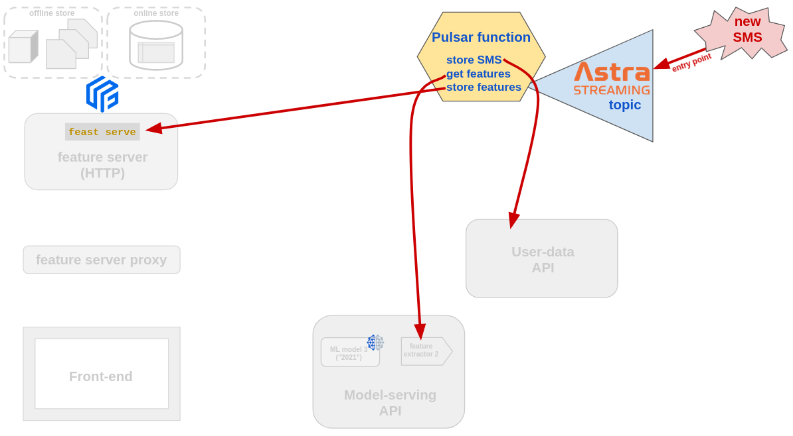

# MLOps speedrun: spam classifier

### Introduction

This repository is a full tutorial/guided tour about
"MLOps Speedrun", designed to illustrate some of the
best practices in dealing with ML tasks in production.

_Highlights:_

- usage of a Feature Store in model-building (training) phase;
- features/model separation for full architecture modularity;
- exposing ML models via API;
- leveraging a NoSQL distributed DB in the cloud to augment the API with caching and possibly rate limiting;
- versioning of models in the API with minimal code duplication;
- integration of the Feature Store in the production flow;
- usage of Push sources and a Feature Server for real-time architecture;
- microservice architecture & separation of concerns;
- (prospected) usage of streaming technologies for a full real-time data pipeline;

The main technologies used are [Feast](https://feast.dev/),
an open-source feature
store for ML, and [Apache Cassandra™](https://cassandra.apache.org),
a NoSQL high-performance database.
For the latter, in particular, the DB-as-a-service offering
["Astra DB"](https://astra.datastax.com/)
by DataStax will be used (free accounts can be created).
The API is created in Python using the [FastAPI](https://fastapi.tiangolo.com/) framework.

The repository, and the instructions in this README, will walk
through the building of a whole production-grade ML-powered architecture
for a realistic (albeit simplified) user-facing application.
Some understanding and previous knowledge is required (e.g. familiarity
with Python and notebooks), but we do a pretty good job of guiding
the reader through all steps in the spirit of a gradual build-up
up to the final result (indeed the README is structured as a "story"
that unfolds step-by-step along with the evolution of a fictional company).

**You should be able to complete all steps in a "tutorial" fashion,
and end up with the final architecture up and running locally, on your computer.**

#### Pre-requisites

- familiarity with a Linux shell such as `bash`;
- Basic knowledge of Python and Jupyter notebooks (the code is all there for you to run, but you probably want to dissect it a bit);
- Ability to handle Python requirement files (preferrably in a virtual environment);
- Elementary knowledge of `git` (you currently have to install a "bleeding-edge" build of [Feast](https://github.com/feast-dev/feast) to use all features of the online store plugin -- don't worry, we provide instructions below)
- `curl`, `jq` to easily handle/display HTTP requests from the command line;
- an [Astra DB instance](https://awesome-astra.github.io/docs/pages/astra/create-instance/), with a [token](https://awesome-astra.github.io/docs/pages/astra/create-token/) and a [secure-connect-bundle](https://awesome-astra.github.io/docs/pages/astra/download-scb/) ready to be used to connect to it.

#### A caveat on versioning

🚧 Note that at the moment, for compatibility reasons (between Feast and Tensorflow),
one has to downgrade `protobuf` _after all other dependencies_ are installed. This
will be presumably resolved in future releases.

## Overview

We follow the MLOps story of a company working
on an application offering a service of spam detection
for SMS messages to their users.

The core task: creating spam detector models, and making them available
within the application/as APIs. Emphasis on the production (or pseudo-production)
aspects, more than on the accuracy of the ML itself.

We'll follow a fictional year-by-year story arc, as the architecture gets
progressively refined.

_Note: unless specified, console commands are to be entered from within
the repo's root directory. You will need several consoles at once to run the
various services and make them play together nicely._

## Setup

In order to reproduce all steps yourself, you need to clone this repo,
[create your database instance](https://astra.datastax.com/), and provide some secrets through dot-env
files and the like. To avoid excessive infrastructure overhead, some
components will be mocked with local (non-production) equivalents.

- Create a Python 3.8+ virtualenv and `pip install -r requirements.txt` into it.
- Add the root of this repo to the Pythonpath of the virtualenv.
- 🚧 **Current workaround** Manually downgrade `pip install protobuf==3.20.1` (at the moment due to compatibility issues with Tensorflow).
- Copy `sms_feature_store/feature_store.yaml.template` to `sms_feature_store/feature_store.yaml` and replace your Astra DB values _(Note: in real life you probably would have run `feast init sms_feature_store -t cassandra` and followed the interactive procedure)_.
- Similarly, copy the `.env.sample` file to `.env` and edit it, inserting the same secrets, keyspace and secure-connect-bundle location you entered in the above feature store configuration file.

## The story

### Chapter 1: 2019

#### Starting data

Our data engineers have collected a labeled set with three columns:
`sms_id`, `text` and `label`, the latter being simply a binary `spam/ham`. This is in
`raw_data/raw_dataset.csv`.

> This dataset could realistically be stored on a database.
> The `raw_data/` directory here plays the role of our own DWH, which we will
> later "connect" to the feature store for our own convenience.

_Note: in order to
create a labeled dataset of around 7.5K messages marked as spam/ham,
two different (publicly available) sets have been merged
(namely [this one](https://archive.ics.uci.edu/ml/datasets/SMS+Spam+Collection)
and [this one](https://archive.ics.uci.edu/ml/datasets/YouTube+Spam+Collection),
made available by the [UCI Machine Learning Repository](https://archive.ics.uci.edu/ml/index.php))._

#### Features 1

Our feature engineers, after some exploratory analysis, have identified
a set of relevant features to build a classifier on.
The extraction of the features from the text is conveniently packed
in function `get_features1` of `analysis/features1/feature_extractor`.

```
python analysis/features1/feature1_extractor.py \
  You are A WINNER OF FREE CASH\!\!\!\!\!\!
```

#### Offline repository for features 1

Our data engineers want to keep all offline ML-related data in one place: for this, they
choose to use [Feast](https://feast.dev/). There will be a source for labels, and one for the features.
The key used to join the two tables will be the SMS id.

> To keep things simple Feast will use the local, file-based offline store,
> which means Parquet files to store data. In the same spirit, the feature
> registry will be a local SQLite database. In an actual production environment,
> the offline store would presumably be a remote database (such as BigQuery).
> Likewise, the store registry would better be stored in the cloud (e.g. on GCS):
> this would enable a workflow where different teams simply clone the project's
> repo and start working on the shared registry.

Run this script to generate the Parquet files which will serve as offline sources to Feast:

```
python scripts/create_offline_sources_1.py
```

Two Parquet files are created in `offline_data/`, one with the labels and
the other with the features, ready to be used as training set.

All rows in each Parquet file bear the same `event_timestamp`
(some arbitrary date in 2019). This is secondary in this case, but would
be relevant if these data did get updated somehow, to allow
for time-travel-consistency in retrieving historical data.

#### Setting up the Feast repo

It's time to set up the Feast feature repository. The Parquet files
we just created will be the offline sources, and - for later usage -
we will set Astra DB as the online store. This amounts to making sure
the right secrets appear in the `sms_feature_store/feature_store.yaml`
file.

> If you haven't already, copy the template `feature_store.yaml.template`
> to `feature_store.yaml`, and make sure to enter your secrets, bundle file
> and keyspace name.

Now, with this Feast CLI command,
```
FEAST_STORE_STAGE=2019 feast -c sms_feature_store apply
```

the local registry will be updated with the feature definitions
found in `sms_feature_store/feature_definitions.py`, and
in the online store (Astra DB) the tables for each feature view
will be created (empty for the time being).

> _Note_: we pass environment variables to Feast commands
> (and later to other commands as well) as a way to emulate
> "evolution over time" of some components of the architecture.
> In a real application, this should generally not be needed.

#### Training the first model ("2019-model")

Why did we go through this hassle with the feature store?
One of the reasons is that different teams are granted standardized access
to the features and the ability to share them easily.

Now, indeed, another team in the company can take these features and train
a classifier model by retrieving labels and features from the feature store.

The data scientists can start reading features from the feature
store, the set of `sms_id` to use for training, and create the
"2019" spam-detection model. Since they like to work with interactive notebooks,
here's what you do:

- start `jupyter notebook`
- locate `training/model1_2019/train_model_1_2019.ipynb`
- run it all the way to storing the trained model. 

> **Note**: the details of the (rather sketchy) training process are not the
> focus of this story and will not be examined in particular depth.

The notebook accesses the Feast store and uses it to retrieve, from offline
storage, the training data. To do so, the join on `sms_id` is done behind
the scenes, by Feast, to give a dataset with features _and_ labels. Note we specify
a date, to ensure we retrieve historically-consistent data ("as if time was
frozen on that day").

Once the data is transformed and the model is trained,
it is saved (using `joblib`) to file `models/model1_2019/model1.pkl`
for later usage.

> In a production environment, the model would be stored e.g. on cloud object
> storage; moreover, if the feature registry were not just a local SQLite, this
> part of the story could well be played on a separate machine, provided this
> repo is cloned there, with its secrets set up.

Here is a sketch of the story so far, from the raw data being put into the
feature store all the way to its retrieval for the training:


#### Serving the model in production (2019)

We are about to launch our first app. In the spirit of microservices,
there will be _two_ separate APIs behind the front-end.

The first is tasked with serving the model. It has endpoints
to convert a text into features, to convert features into a prediction,
and one which combines the two and makes a text directly into a prediction.

The API, implemented with [FastAPI](https://fastapi.tiangolo.com/), is written in a modular way in
order to serve, in the future, several versions
of several models using the same (version-prefixed) endpoint pattern.
This is achieved by wrapping
the model (as stored during training) in a specific class, which in turn
subclasses a generic `TextClassifierModel` interface; instances of these
classes, one per model/version, are given to a factory function that creates
a corresponding FastAPI "router".

**Note**: this API makes a "collateral" use of Astra DB (1) as a cache for
predictions that were already computed, and (2) to store the log of all
recent API calls per user (see below for details). In order
to set up the corresponding tables, if you haven't done so yet,
first copy the `.env.sample` file to `.env` and
edit the values therein (similarly as the feature store definition yaml file),
then run the script `python scripts/initialize_model_serving_api_caches.py`
just once.
If you later see errors similar to _"Cache-read operation failed. Make
sure cache table exists."_, chances are you did not run this
initialization script.

At this stage, we can only serve model `v1`. To start the API,
```
SPAM_MODEL_VERSIONS="v1" uvicorn api.model_serving.model_serving_api:app
```

and to test it you can try:
```
curl -XPOST \
  http://localhost:8000/model/v1/text_to_features \
  -H 'Content-Type: application/json' \
  -d '{"text": "I have a dream"}' | jq

curl -XPOST \
  http://localhost:8000/model/v1/features_to_prediction \
  -H 'Content-Type: application/json' \
  -d '{"features": [0.09090909090909091,0.0,0,0,0,0,0,0,0]}' | jq

curl -XPOST \
  http://localhost:8000/model/v1/text_to_prediction \
  -H 'Content-Type: application/json' \
  -d '{"text": "I have a dream"}' | jq
```

You can also check the auto-generated OpenAPI docs: `http://127.0.0.1:8000/docs`.

Note that in principle this API could be used not only by the front-end
(i.e. for text-to-prediction, for the time being), but also by
backend services, e.g. one tasked with writing rows to a feature store
from the raw input SMS text (which will happen later).

#### A note on caching (optional reading)

The model-serving API, conceptually, has nothing to do with DB storage.
Still, under the assumption that running a prediction is more expensive than
a fast database lookup (and assuming deterministic output),
the API code is equipped with an Astra DB table acting as cache of past calls.

This requires making the database accessible from within this API (hence
the `.env` setup above), creating a table holding the cached entries (hence
the initialization script) and adding some logic to the router endpoints.

There is a single table holding cached results from all endpoints, thanks to
the choice of having model version and endpoint path part of the table
primary (and partition) key.

At each request, the cache is checked and, if something is found,
it is returned instead of running the model (or feature extractor)
and returning the live result. Things get more complicated if we want
to add endpoints to act on a _list_ of inputs (e.g. several texts
at once): there, to maximize performance, we need to separately treat
the cached and the novel entries while feeding the latter to the model at once.
This problem is solved, for example, in the `multiple_text_predictions`
endpoint of [this example API](https://github.com/datastaxdevs/workshop-ai-as-api/blob/main/api/main.py).

In this code, for simplicity, we synchronously store the items to the
cache _before_ returning to the caller, but this is not really optimal:
we could shave off a few milliseconds by scheduling the cache-write _after_
the response is sent out. To do that, we might make use of FastAPI's
[background tasks](https://fastapi.tiangolo.com/tutorial/background-tasks/).

#### A note on the "recent call log" (optional reading)

The model-serving API also keeps tracks of each call it receives,
storing them in a call-log table which can then be inspected
with a dedicated `/recent_call_log` endpoint (**Tip**: look for this endpoint
in the [auto-generated API docs](http://127.0.0.1:8000/docs)).

The log entries are stored to an Astra DB table, with a pre-configured
time-to-live of one hour (to avoid unbound growth of the row count).
Of course, the performance
pros and cons of storing each and every call must be evaluated on a
case-by-case basis, but this could be a good starting point to implement
for instance a rate limiter.

At the moment this feature is not used directly in the client: it can
be tested with the following command (which will return a nonempty list
provided you ran at least the test invocations given above):
```
curl localhost:8000/model/v1/recent_call_log | jq
```

The same consideration as for the cache holds about the opportunity
of moving the call-log-write operation to a background task to avoid
having the caller pay for the (however small) associated extra latency.

> **Note**: the current implementation, moreover, simply reads the
> request originator's IP address to evaluate the `caller_id` for
> each call: this would not work as expected when behind a proxy
> or a load-balancer, in which case the API should look for the
> value of the `X-Forwarded-For` request header.

As a last remark, in case the number of items retrieved by the
`/recent_call_log` endpoint is expected to be very high, it might be
unwieldy to first fetch them all and then send them in the request;
an alternative, leaner approach, based on lazily consuming the rows returned
by the database query and constructing the response as "Chunked",
can be seen at work for instance [here](https://github.com/awesome-astra/sample-astra-fastapi-app/blob/main/api.py#L47-L53).

#### The user-data API

The other API, kept as a separate service out of cleanliness,
will handle the data of our app users. The app (front-end) is a simple
SMS service, whereby users can visualize their inbox.

> Throughout this demo, security, authentication and other matters
> are ignored to better focus on the main topics. _Don't do this in production._

The API has endpoints to retrieve the messages stored as belonging to a given
user's inbox (either all of them or one by one by their message ID).

The data is stored on an Astra DB table, with a simple structure: there are
columns `user_id` (recipient), `sms_id` (a time-ordered unique TIMEUUID),
`sender_id` and `sms_text`. The primary key is `(( user_id ), sms_id)`,
with a partitioning that makes it easy to retrieve all messages for a given
user at once.

> Notes: (1) for more on partitioning in Cassandra and Astra DB,
> sadly not the focus of this writeup, we recommend
> the workshop about ["Data Modeling"](https://github.com/datastaxdevs/workshop-cassandra-data-modeling).
> (2) In a real production app,
> mitigation techniques would be put in place to prevent partitions from growing
> too large (i.e. if a user starts hoarding enormous amounts of messages).
> (3) Here, for simplicity, we'll keep the table in the same keyspace as the
> rest of the architecture: such a choice might not be optimal in a real app.
> (4) User IDs could be better defined using the `UUID` Cassandra data type,
> but here we wanted to
> keep things simple for demonstration purposes.

First, if you didn't do it already, provide the Astra DB credentials
by copying file `.env.sample` to `.env`
and filling the required values (much like you did for the feature-store
YAML file above).

Now you can run this script to create the table and populate it with
sample data:
```
python scripts/initialize_user_api_data.py
```

> Tip: you can check the data with the following CQL query:
> `SELECT sms_id, toDate(sms_id), sender_id, sms_text FROM smss_by_users WHERE user_id='max';`.

The user-data API can now be started in another shell
(also on a different port than the other API):
```
uvicorn api.user_data.user_api:app --port 8111
```

You can test it with:
```
curl http://localhost:8111/sms/max | jq

curl http://localhost:8111/sms/fiona/32e14000-8400-11e9-aeb7-d19b11ef0c7e | jq
```

(and see the docs at `http://localhost:8111/docs` as well.)

#### The frontend

The Web app is a simple React app where users "login" by entering their name
and can see their inbox. For each SMS, they can reach the spam-detection API
and get an assessment on the message text (by clicking on the
magnifying-glass icon 🔍 next to each message).

To start the client:
```
cd client/sms_web_app
npm install
REACT_APP_SPAM_MODEL_VERSION=v1 npm start
```

(note that we pass the model version for correctly speaking to the
model-serving API), then open `http://localhost:3000/` in the browser.

>*Tip*: enter `fiona` or `max` as "username", to see some SMS messages.

Here is a sketch of this first architecture, with the front-end and the
services it connects to:


### Chapter 2: 2020

#### A new spam model

It's 2020, and the data science team decides to train a new, better model from
scratch using the same labels. The model, however, is radically different,
and the required features differ too.
The plan is to use a LSTM recurrent neural network, and a Tensorflow
`Tokenizer` to convert the text to the feature list.

The tokenizer is first
fitted on the training set and then persisted to file, so to have it
available when later exposing the "text to features" capability of the model.

Run
```
python scripts/create_tokenizer_2.py
```
to achieve the above. As a result, the tokenizer file (and associated metadata)
will be created in `models/model2_2020/tokenizer/`.

> _Note_: If you run into an error about `protobuf` having a version mismatch,
> chances are you forgot to downgrade the package as suggested in the [Setup](#setup)
> section (this is a temporary workaround that will be addressed in the future).
> Please do that and try again the above.

As was done for the features "v1", the text-to-features mapping,
which loads and uses the just-stored tokenizer, is made available as a
standardized class (compliant with the same generic `FeatureExtractor`
interface as the previous version) and can be checked with:
```
python analysis/features2/feature2_extractor.py \
  You are A WINNER OF FREE CASH\!\!\!\!\!\!
```

#### A new feature view in Feast

Similarly to what was done for the "2019" (or "v1") features,
a local-storage (Parquet-file-based) source is created and the
Feast store is updated so that it reflects the presence of
a new feature view and feature service (the one pairing the labeled
set with the new "v2" feature vector).

First the Parquet file is generated by calculating the features for
all of the training data:
```
python scripts/create_offline_sources_2.py
```

Then a new `FileSource`, `FeatureView` and `FeatureService` are added to `sms_feature_store/feature_definitions.py`
(check usage of `FEAST_STORE_STAGE`
there for more details, as we "emulate" changes in the feature
definitions by environment variables) and finally the updated repository is "applied" again,
so that the changes are reflected to both the registry and the online-store
data structures (viz. Astra DB tables):
```
FEAST_STORE_STAGE=2020 feast -c sms_feature_store apply
```

_Note that this time the "features" are a single `Field` in the feature view
(a field of type `Array(Int64)` in Feast parlance, as opposed to individual
`Field`s for the "v1" features of 2019)._

Here is a sketch of how, within Feast, the "source", "feature view" and
"feature service" abstractions build one on top of the other in the offline store:


#### Training the model

It is now time to create the model and train it. This requires devising
the network architecture, re-casting the labels with one-hot-encoding,
and start with the actual training.

As usual, this is done in a notebook: running all of
```
training/model2_2020/train_model_2_2020.ipynb
```
will result in the model being stored, for later usage, in
`models/model2_2020/classifier`.

#### Extending the model-serving API

Now in order to upgrade the model-serving API so that it can also
expose the new model ("v2", i.e. the 2020 model, including its feature
extractor) all we need to do is to create the `KerasLSTMModel` subclass
of `TextClassifierModel` and wire it to the API with the dynamic
FastAPI router factory used already for `"v1"`.
Fortunately, this is done already for you:
see file `api/model_serving/aimodels/KerasLSTMModel.py` and
the `"v2"` part in `api/model_serving/model_serving_api.py`.
To start the API with
both models (`Ctrl-C` it first if still running from earlier):
```
SPAM_MODEL_VERSIONS="v1,v2" uvicorn api.model_serving.model_serving_api:app
```

and to test the endpoints for the new model:

```
curl -XPOST \
  http://localhost:8000/model/v2/text_to_features \
  -H 'Content-Type: application/json' \
  -d '{"text": "I have a dream"}' | jq

curl -XPOST \
  http://localhost:8000/model/v2/features_to_prediction \
  -H 'Content-Type: application/json' \
  -d '{"features": [0.0,0.0,0.0,0.0,0.0,0.0,0.0,0.0,0.0,0.0,0.0,
                    0.0,0.0,0.0,0.0,0.0,0.0,0.0,0.0,0.0,0.0,0.0,
                    0.0,0.0,0.0,0.0,0.0,1.0,20.0,4.0]}' | jq

curl -XPOST \
  http://localhost:8000/model/v2/text_to_prediction \
  -H 'Content-Type: application/json' \
  -d '{"text": "I have a dream"}' | jq
```

Here is a sketch of how the various model versions are installed in the FastAPI
application by means of routers generated from a "router factory" function:


_**Note**: the image shows also the "v3" model, see below. Notice that also
model "v3" uses the "v2" features: don't let that fool you (in a real-life
ML company much, much worse can happen 😈 ...)_

#### Client test for "v2"

Provided both API services are running (remember also the user-data API
`uvicorn api.user_data.user_api:app --port 8111`), this is simply:
```
REACT_APP_SPAM_MODEL_VERSION=v2 npm start
```

(Again, you may have to `Ctrl-C` to stop the running client, re-start it
and refreshing the app in the browser until it says _Using model version "v2"..._)

### Chapter 3: 2021

#### A new model on old features

The data science team decides to take the challenge again
and starts building a new, more accurate spam detection model,
which will be "v3" a.k.a. "2021".

> *Hint*: it may well have been another team doing this: having a feature store
> as a central "hub" indeed enables feature discovery across teams. Check the
> script `python scripts/feature_store_explorer.py` to see how the feature store
> can be directly inspected to look for existing features.

They decide to start from the same features as the previous model, though:
In the spirit of this demo, this is also to emphasize the modularity
of the moving parts at play:

- no need for new elements in the feature store
- the spam-detection API will have a new "v3" set of endpoints, combining the same feature extractor as "v2" with a new trained model. To reiterate: model "v3" will use features "v2" exactly like model "v2" (crazy, eh?)

This model will be an improvement over "v2", with a similar architecture (LSTM recurrent neural network
with slightly different parameters). Training will take place, similarly as before, by running the notebook
```
training/model3_2021/train_model_3_2021.ipynb
```

and, as a result, the model will be stored in `models/model3_2021/classifier` (no need for a separate `tokenizer` directory as it'll use the one from v2).

Similarly as what was done for "v2", a new set of "v3" routes
is added to the model-serving API, which can now be started
as:
```
SPAM_MODEL_VERSIONS="v1,v2,v3" uvicorn api.model_serving.model_serving_api:app
```

and tested with:
```
curl -XPOST \
  http://localhost:8000/model/v3/text_to_features \
  -H 'Content-Type: application/json' \
  -d '{"text": "I have a dream"}' | jq

curl -XPOST \
  http://localhost:8000/model/v3/features_to_prediction \
  -H 'Content-Type: application/json' \
  -d '{"features": [0.0,0.0,0.0,0.0,0.0,0.0,0.0,0.0,0.0,0.0,0.0,
                    0.0,0.0,0.0,0.0,0.0,0.0,0.0,0.0,0.0,0.0,0.0,
                    0.0,0.0,0.0,0.0,0.0,1.0,20.0,4.0]}' | jq

curl -XPOST \
  http://localhost:8000/model/v3/text_to_prediction \
  -H 'Content-Type: application/json' \
  -d '{"text": "I have a dream"}' | jq
```

As for the client, it can be made to point to the new model with (`Ctrl-C` it first if needed:
```
REACT_APP_SPAM_MODEL_VERSION=v3 npm start
```
(provided the user-data API is also running: remember `uvicorn api.user_data.user_api:app --port 8111`).

#### Toward real-time

Now the company wants to improve the service to the users
by adding ingestion of new SMS messages into the app.

To continue adhering to a microservice approach, there will be yet another API,
the "Inbox API", tasked with offering to external actors
(such as the telephone company) an endpoint to insert new messages
into our system. This webhook will take care, internally, of everything
needed to deal with the arrival of a new message.

So far, we have used
Feast's "offline feature store" capability, i.e. specialized methods to
retrieve point-in-time data from what essentially is a time-series warehouse.
Now it's time to start using the **online store**: a low-latency data store
where the latest features for any given entity are saved for fast retrieval.
In practice, while the offline store contains the whole time series (the "history")
of the feature values for an entity, the online store is where only the most
up-to-date entry will be kept.

There are various ways to "refresh" the online store. One such approach is to
manually invoke the "materialize" operation, which will scan the offline store
(starting from the last materialization done so far) and transport the data over
to the online store.
There are plugins to use several databases as online store: as can be seen in
`sms_feature_score/feature_store.yaml`, we are using Astra DB through the
[Cassandra](https://docs.feast.dev/reference/online-stores/cassandra) Feast online store plugin.

> The rationale behind keeping the latest features in the online store, in our
> case, is that computing the features can be expensive to do in real-time when
> the user needs them, so we prefer to pre-compute them
> as soon as the new raw data comes in. Other valid solutions might involve
> enqueueing their computation, for instance in an Apache Pulsar© topic, for consumption
> as a background asynchronous task. See the end of this writeup for sketches of such
> solutions, build on Astra Streaming, Pulsar functions and possibly Astra DB and CDC.

Materialization is invoked with an explicit date parameter: it will consider
all offline data up to that moment, "as if time stopped at the provided date".
_This is not essential here, but imagine for a moment that your user data
(features) change over time, such as a
"last 10 items purchased" metric. These, at each user interaction, would be
accumulated in a time-series fashion (in our case, in the parquet files).
By scheduling a periodic (incremental) materialization, one makes sure that
the online store gets updated and contains the latest value for this metric.
The online store can then be queried to quickly obtain an up-to-date feature
set, ready for real-time prediction._

#### Materialize

We have a tiny "sampler" script that tries to fetch a few "v1" and "v2" features
from the online store, and we'll use it in this section to illustrate
what's going on. Try running
```
python scripts/online_store_sampler.py sms14050 sms14051 sms14052
```
and you should see that nothing is found (yet!) on the online store for any
feature service.

Now we'll pretend for a moment that it's still 2019 and we materialize
from "the beginning of time" to the end of the year. This should catch all
and only the entries in the "v1" feature set (along with the label set)
and transport them over to the online store:
```
feast -c sms_feature_store materialize 2009-01-01T00:00:00 2019-12-31T00:00:00
```
_(Note that this process may take a few minutes to complete.)_

Running the online sampler script now,
```
python scripts/online_store_sampler.py sms14050 sms14051 sms14052
```
will show that the `labeled_sms_1` features are found in the online store,
while the `labeled_sms_2` (created in 2020) are not there yet.

Now it's time to do an incremental materialize step and bring the
online store up to date:
```
feast -c sms_feature_store materialize-incremental 2021-09-02T00:00:00
```

The online sampler script will now find features for both feature services:
```
python scripts/online_store_sampler.py sms14050 sms14051 sms14052
```

_As remarked above, we could content ourselves with a new-message-ingestion
process that writes to the offline store, and a scheduled materialization
to have the features ready to be served to the app. But we want to do better..._

Feast provides two very interesting tools to make our app more streamlined:
a feature server and push sources. Let's see how they can become part of
our production pipeline and get us closer to a real-time architecture.

#### Feature server

Most operations on a Feast store can be exposed by the "feature server", which
is an HTTP API wrapping the core operations. To start it, you can simply run:

```
feast -c sms_feature_store serve
```
Now you can start querying it (the default port is 6566) to retrieve feature values,
either asking for an explicit list of features from one or more feature views:
```
curl -s -X POST \
  http://127.0.0.1:6566/get-online-features \
  -d  '
        {
            "features": [
                "sms_features1:cap_r",
                "sms_labels:label"
            ],
            "entities": {
                "sms_id": [
                    "sms14050",
                    "sms14051",
                    "sms14052"
                ]
            }
        }
      ' | jq
```
or directly specifying a feature service:
```
curl -s -X POST \
  http://127.0.0.1:6566/get-online-features \
  -d  '
        {
            "feature_service": "labeled_sms_2",
            "entities": {
                "sms_id": [
                    "sms14050",
                    "sms14051",
                    "sms14052"
                ]
            }
        }
      ' | jq
```

#### Push sources

Another crucial element in Feast are _push sources_. These, which get
"attached" to regular sources, allow for dynamic pushing of new entity
rows (with their features) and, combined with the above HTTP feature server,
make it possible to use Feast as infrastructure for inserting new data into
the store in real-time.

We'll enable a push source for our "v2" features, with the goal of using
it to handle the real-time architecture outlined above, with the "v2" features
pre-computed upon SMS ingestion, ready to be then used for
user-initiated predictions.

We start by altering the feature definitions for the store: until now we had
the `FileSource` wired to the `FeatureView` through the `source` parameter in the latter
(namely `smss2 -> features2_view`); now we'll have a chain
`FileSource -> PushSource -> FeatureView`, i.e.
```
smss2 -> smss2_push -> features2_view
```
The nice thing is that once we have this setup, anything we push will be
automatically propagated along this chain.

The changes are encoded in the `sms_feature_store/feature_definitions.py`
once we set the environment variable `FEAST_STORE_STAGE=2021`, so now we need
to run
```
FEAST_STORE_STAGE=2021 feast -c sms_feature_store apply
```

Make sure the feature server is restarted after this (`Ctrl-C` and then re-run
the `feast -c sms_feature_store serve` command).

We can now *push new entity rows to the feature store* directly through
the feature server. The following command will push a newer version
of the "v2" features for the SMS with `sms_id='sms14052'`, _both to the offline
and the online store_:

```
curl -X POST "http://localhost:6566/push" -d '{
    "push_source_name": "smss2_push",
    "df": {
            "sms_id": ["sms14052"],
            "event_timestamp": ["2021-09-02 00:00:00"],
            "features": [[1,1,1,1,1,1,1,1,1,1,1,1,1,1,1,1,1,1,1,1,1,1,1,1,1,65,65,108,2,30]]
    },
    "to": "online_and_offline"
  }'
```

Let us check the online store with the script:
```
python scripts/online_store_sampler.py sms14052
```
and by querying the server:
```
curl -s -X POST \
  http://127.0.0.1:6566/get-online-features \
  -d  '
        {
            "feature_service": "labeled_sms_2",
            "entities": {
                "sms_id": ["sms14052"]
            }
        }
      ' | jq
```

In short:

- the offline store has received a new line in its time-series, with more recent timestamp;
- in the online store, the entry for that SMS and for features "v2" has been overwritten and the new values are ready to be used.

This bypasses the need to run an explicit materialization step (scheduled or otherwise).

> _Note_: Overwriting the features for this `sms_id` is just for demonstration
> purposes: the new feature values make little sense in
> themselves. Still, this will be harmless - even if we were to repeat the
> training step, the point-in-time offline feature retrieval would not fetch
> this update as its date is beyond the `training_timefreeze` used in
> the training notebook; moreover, incidentally, SMS messages from
> the _training_ set are not used anywhere else in the app.

Here is a sketch of how the push source extends the "chain" between a (batch)
source and a feature view in Feast, and how the feature HTTP server can act
as entry point for insertion of new data in the store:


#### App architecture II

It is now time to revise the app and take advantage of the Feast
feature server and the push sources. The changes are as follows:

- the newborn "Inbox API", when receiving a new message, will:
  + write the SMS to the database table for the user-data API: to do that, we add a "write SMS" endpoint to the user-data API itself;
  + contact the model-serving API to get the "v2" features;
  + contact the feature server to push these "v2" features to the feature store, for later online usage (by model "v3");
- the client will ask the feature server for the features of an SMS, based on its `sms_id`. (_Note: even just to avoid CORS issues, it is necessary to build a thin proxy between the client and the Feast feature server._)
- it will then query the `v3/features_to_prediction` endpoint in the model-serving API to get the ham/spam status of a message;
- (we also need a backfill job to prepare the `labeled_sms_2` features for the messages that are already in the inbox at this point);

Here is a sketch of this revised architecture:


Let's review the changes:

##### User-data API

The new endpoint works similarly as the existing ones, i.e. it is a thin wrapper
around a database write, which makes use of Cassandra driver and ["prepared statements"](https://docs.datastax.com/en/developer/python-driver/3.25/api/cassandra/query/#cassandra.query.PreparedStatement).
Stop the running API with `Ctrl-C` and restart with:
```
ARCHITECTURE_VERSION=II uvicorn api.user_data.user_api:app --port 8111
```

You can now test an insertion with (note that a unique `sms_id` is created automatically):
```
curl -XPOST "http://localhost:8111/sms/ellen" \
  -H 'Content-Type: application/json' \
  -d  '
        {
            "sender_id": "otto",
            "sms_text": "Can u get me some cabbages at the grocery store?"
        }
      ' | jq
```

and then
```
curl http://localhost:8111/sms/ellen | jq
```

##### Inbox API

This is a brand-new, very simple API with a single endpoint.
Start it with
```
uvicorn api.inbox.inbox_api:app --port 8222
```

and emulate the whole new-SMS insertion process with:
```
curl -XPOST "http://localhost:8222/sms" \
  -H 'Content-Type: application/json' \
  -d  '
        {
            "recipient_id": "otto",
            "sender_id": "ellen",
            "sms_text": "They only have turnips left. What do I do?"
        }
      ' | jq
```

To check the insertion, you can run
```
curl http://localhost:8111/sms/otto | jq
```
and then run the "online store sampler" with the corresponding `sms_id`:
```
SMS_ID=$(curl -s http://localhost:8111/sms/otto | jq -r '.[0].sms_id')
python scripts/online_store_sampler.py "$SMS_ID"
```

The new message appears both in the user-data DB and in the online store
(in particular, the online store will only have the "features v2"
number vector for it).

##### Backfill job

Before declaring back-end victory, there remains to run a backfill job to make
sure every entry in the user-data table has its feature-store "v2" counterpart.

This is easily done with (note that 'otto' is already covered):
```
python scripts/push_v2_features_to_store.py max fiona ellen
```

Notice that this script also illustrates programmatic (i.e. SDK) usage
of Feast push source logic, as opposed to sending HTTP requests to
the feature server. _(It also shows that one should always access Cassandra
tables by partition key - were it necessary to really scan the whole table at
once, an OLAP solution such as Spark would be advisable on top of Cassandra.)_

> You can use the `online_store_sampler.py` script with one of the `sms_id`
> values you see in the output to try and read its (v2-only) features from the
> online store.

##### Client

The last step in this architecture upgrade concerns the client. Depending
on the provided "architecture version" (now set to `II`), a different
logic is in place to get the spam/ham status of a given message.

First, start the (very thin) proxy service which simply forwards calls to the
feature server, put in place so that no CORS issues get in the way. (_Incidentally,
it is always advisable not to directly connect the feature store and a
user-facing client._):
```
uvicorn api.feature_server_proxy.feature_server_proxy_api:app --port 8999
```

Finally start the client, instructing it to use the new "real-time" architecture:
```
REACT_APP_ARCHITECTURE_VERSION=II REACT_APP_SPAM_MODEL_VERSION=v3 npm start
```

Reload `http://localhost:3000` on your browser and enjoy the show.


> For more fun, you can use the Inbox API to add a new message to your inbox
> and click the "refresh" (🔄) button on the front-end to make sure the flow
> is flawless (i.e. the Inbox API has done its job).
> _Bonus question_: if you add an SMS using the [user-data API](#user-data-api) directly
> (as opposed to invoking the Inbox),
> how does the client behave? Why? (... would it be reasonable to provide a
> working alternate path to the app?)


### Chapter 4: what now?

As usually happens, as an architecture grows there are more and more options
to choose from. Depending on the particular needs, the two ideas sketched below,
which make use of streaming technologies (as in "event streaming"), may be
the best solution for a real-time, streamlined backend workflow.

> **Note**: these are not implemented in this tutorial. The reason is that
> these would work best with the Apache-Pulsar-as-a-service ["Astra Streaming"](https://docs.datastax.com/en/astra-streaming/docs/index.html)
> (especially the second one, which is tied to Astra DB through the
> CDC connection); but this requires calling API endpoints from within the "Pulsar
> functions" (which are executed in the cloud), and we wanted to keep all services
> running locally on your computer in this demo. You are welcome, of course,
> to try and provide all relevant moving parts with a public IP and try to implement
> this architecture. Who knows if in a future upgrade we will provide just that?

#### Streaming topic as entry point

the (push-based) "Inbox API" disappears, replaced by an Astra Streaming (i.e.
Apache Pulsar) topic where external actors simply push new SMS messages (possibly
through a thin outward-facing API).

On this topic sits a ["Pulsar function"](https://pulsar.apache.org/docs/functions-overview/) that essentially plays the role
of the ingest-new-message endpoint that was in the Inbox API, but in a
"serverless" way. This can (and should) be equipped with a retry-topic to ensure
everything gets through.



#### Database + CDC to Streaming as entry point

Alternatively, the entry point could be the user-data API itself, exposing
insertion of a new SMS to external actors. Then, the Streaming topic would be
automatically populated by the CDC ("change data capture") mechanism, whereby
a process listening to any change to the `smss_by_users` database table publishes
them to the topic. In this way the Pulsar function on the streaming topic
would just have to deal with the feature computation and storage.


